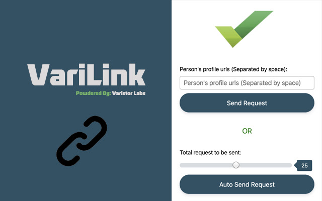

# VariLink
LinkedIn Auto Connect Tool - VariLink

## Google Chrome Extenstion

Easiest way to automate LinkedIn connection requests. Send connections with a single click and without any manual efforts.
Easiest way to automate LinkedIn connection requests. Send connections with a single click and without any manual efforts.

This extension allow you to auto connect and send automated message to your business prospects on LinkedIn with a single click of a button and save your hours of manual work.

How does it work:
There are two options to send the connection request -

1. Paste all the individual's profile url (separated by space) to whom you want to send the request.
   Click on the button and it opens the profiles one by one and sends the connection request with an automated message.

2. Set the limit on how many connection request you want to send in one attempt and click on the button.
   It opens the mynetwork page of linkedin and sends the connection request.

Disclaimer: 
The 'LinkedIn Auto Connect Tool - VariLink' chrome extension is not endorsed or certified by LinkedIn and it's not affiliated with LinkedIn in any way. 
All LinkedIn logos and trademarks that may appear in this tool are property of LinkedIn.

Extension link: https://chrome.google.com/webstore/detail/linkedin-auto-connect-too/ljjnjoakmggchhmklkmkjejejkibpcab
